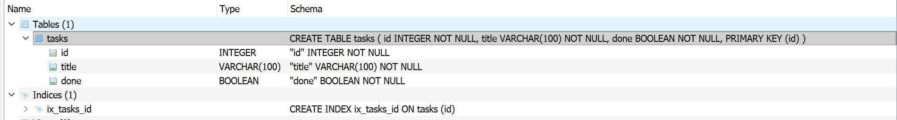
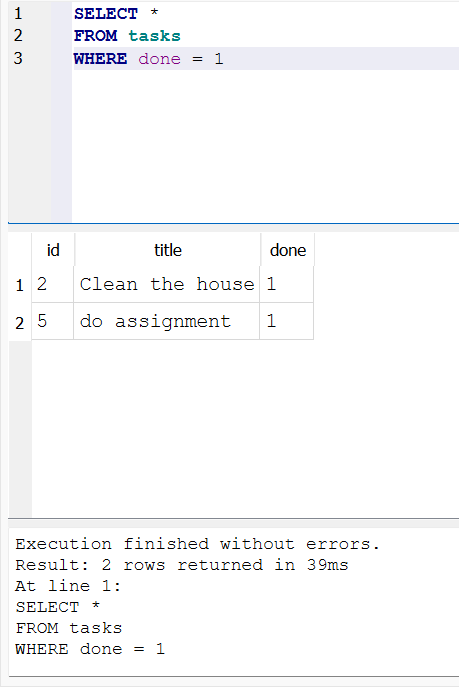

# Task Management API (SQLite Edition)
A Lightweight RESTful API built with FastAPI and SQLAlchemy, using SQLite for persistent database storage.

This project evolved from an in-memory task tracker into a database-driven API. It demonstrates the core backend engineering principle that persistence is an implementation detail—the client interacts with the exact same API endpoints, but the data now survives server restarts.

## Tech Stack & Database Choice

Framework: FastAPI

ORM: SQLAlchemy

Database: SQLite

Data Validation: Pydantic

## Why SQLite?
SQLite was chosen because it is a lightweight, zero-configuration, file-based database engine. It requires no separate database server process to run or manage. The database is stored inside a single file (tasks.db) directly within the project directory, making local development, testing, and sharing simple.

## Database File Location & Schema
The database file is automatically generated in the root directory of the project when the application starts:

    .
    ├── database file  -->  tasks.db
    ├── main.py
    └── README.md

### Schema of the Database
This is the schema of the Database in DB Broswer application.

### Querying the Table

    SELECT * 
    FROM tasks
    WHERE done = 1

## How to Run the Project

1. Clone the Repository

    `git clone <[text](https://github.com/FatimaMuhammad90/crud_api_now_with_database)>
   
    cd <Task2(week3)>`

2. Set Up a Virtual Environment & Install Dependencies
    # Create a virtual environment
   ` python -m venv venv`

    # Activate virtual environment
    # On Windows:
   ` venv\Scripts\activate`
    # On macOS/Linux:
   ` source venv/bin/activate`

    # Install required dependencies
    `pip install fastapi uvicorn sqlalchemy pydantic
`
3. Run the API Server

    `uvicorn main:app --reload`